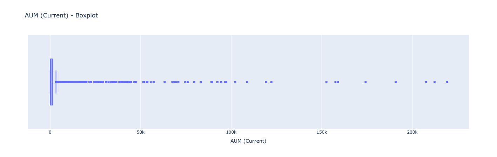
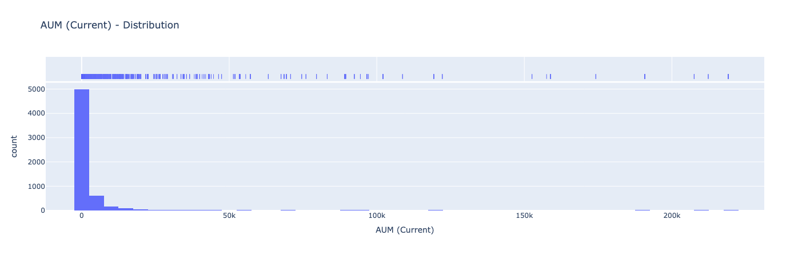
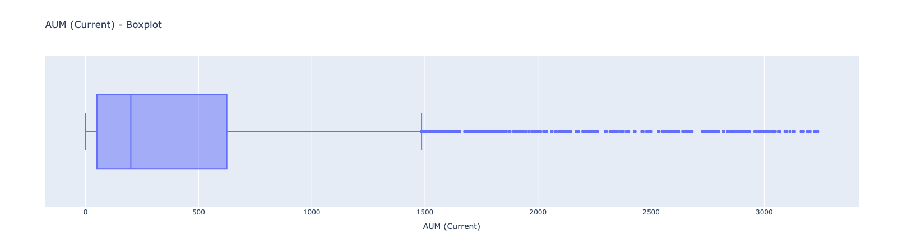
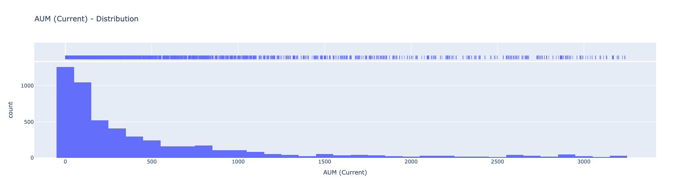
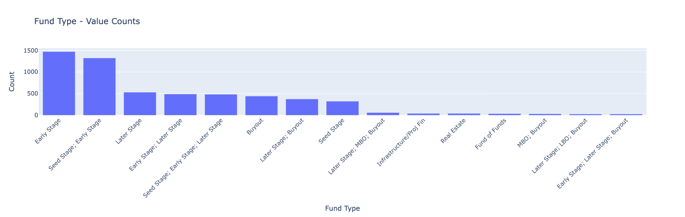
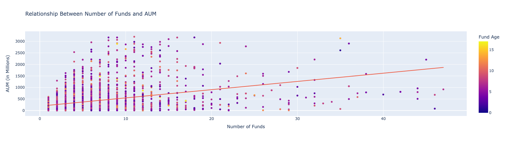

# Introduction

# Data Cleaning and Exploratory Data Analysis

The raw dataset contained data for over 6000 funds, which was cleaned by handling missing values and standardizing existing ones. Key steps included:

- The inital datatset contained a 'Fund Open Date' column, which was used to create the newer 'Fund Age' column that stores the number of years that the VC fund has been active for. This transformation was done so that 'Fund Age' could directly  better analyse the performance of the VC fund. 
- The inital dataset contained a 'Fund Invests in Multiple Rounds' coumn, which refers to when a fund invests more money in a company that has already received funding from them. This can be a strategic move to increase their stake, protect their ownership, or support the growth of a promising startup. However, on further analysis of this column, it had missing data for 5200/6200 firms. Hence, for the lack of complete data, this this column was dropped from the final dataset.
- I did some visual analysis to better understand the distribution of some columns, and this led me to find out that some of the data was highly skewed and contained significant outliers. An example of this can be seen with the 'AUM' column which stores the Assets Under Management of a fund in millions.

-  To handle extreme outliers in the AUM (Assets Under Management) variable, I applied IQR-based filtering rather than the standard three-standard-deviation rule. The AUM distribution was highly right-skewed, with a small number of funds reporting exceptionally large values that inflated both the mean and standard deviation. Using the IQR method allowed for a more robust identification of outliers based on the interquartile range, rather than being distorted by extreme values. This filtering reduced the impact of unusually large AUM values and resulted in a dataset that more accurately reflects the central tendency of most funds, improving the quality of subsequent visualizations and analysis. After cleaning the data, the resulting distribution was a lot more symmetric, as can be seen below.

-  After data cleaning steps, the total number of oobservations dropped to 4820.

### Preview of Cleaned Data

| Fund Name            | Fund Status | Fund Open Date | Fund Type   | Fund Country Focus | Fund Industry Focus                         | AUM (Current) | Firm # of Funds | Average Fund Size (MM) | Fund Amount Sought | Fund Amount Raised | Fund Age |
|----------------------|-------------|----------------|-------------|--------------------|----------------------------------------------|----------------|------------------|--------------------------|---------------------|---------------------|----------|
| 01 Advisors 01 Fund  | Divesting   | 2019-05-03     | Early Stage | United States      | Other                                        | 855.00         | 3.0              | 285.00                   | 200.00              | 135.00              | 6        |
| 01 Advisors 02 LP    | Investing   | 2021-01-20     | Later Stage | United States      | Internet Software/Services                   | 855.00         | 3.0              | 285.00                   | 325.00              | 325.00              | 4        |
| 01 Advisors 03 LP    | Investing   | 2022-03-24     | Early Stage | United States      | Packaged Software; Internet Software/Services| 855.00         | 3.0              | 285.00                   | 325.00              | 395.00              | 3        |
| 01fintech LP         | Investing   | 2022-01-01     | Buyout      | United States      | Other                                        | 61.90          | 1.0              | 61.90                    | 300.00              | 61.90               | 3        |
| 01vc Fund II LP      | Investing   | 2019-01-01     | Early Stage | China              | Other                                        | 14.57          | 3.0              | 14.57                    | 14.57               | 14.57               | 6        |

###  Insights from EDA:
Doing visual analysis showed a couple different insights. 
- Most funds are focused in the US, 2377. India is a far 2nd, with 213 firms. This makes intuitive sense beacuse most of VC money is present in the US. In fact, most of VC money goes to SF-based startups! [TODO]

- Most funds in the dataset are Early Stage funds. There are some funds that invest in a couple different stages as well. This also makes inutive sense beacuse there are lessser am9unt of funds with more money to do later stage invsting, as the later you go into the investment roudns, the hgihest the investmenet number becomes and can reach upto billions of dollars. 

– This scatter plot explores the relationship between the number of funds managed by a firm and its current assets under management (AUM). Each point represents a fund, color-coded by its age.

  

We observe a **slightly positive trend** — as the number of funds increases, the AUM tends to increase as well. However, the relationship is **weak and noisy**, with a wide spread of AUM values even among firms managing a similar number of funds.

The color gradient suggests that **fund age does not strongly influence AUM**, though older funds (in yellow) are scattered throughout the range. This implies that factors beyond longevity and fund count may be more significant in driving asset accumulation.

### Type vs AUM
This grouped table highlights the average AUM for funds operating at different investment stages. Funds that span multiple stages — especially those combining early stage, later stage, and buyout strategies — tend to manage significantly higher assets.

This suggests that broad-stage or hybrid investment approaches are associated with larger fund sizes. Rather than pure early- or late-stage specialization, many of the top-performing fund types include a blend of stages, indicating greater flexibility and potentially broader appeal to investors.

| Fund Type                                           | Average AUM (in Millions) |
|----------------------------------------------------|---------------------------:|
| Early Stage; Fund of Funds; Secondary; Buyout      | 3167.71                    |
| Seed Stage; Early Stage; Later Stage; Secondary... | 2102.77                    |
| Seed Stage; Early Stage; Later Stage; Fund of Funds| 1787.27                    |
| Early Stage; Later Stage; LBO; MBO; Buyout         | 1777.40                    |
| Early Stage; Real Estate                           | 1764.08                    |
| ...                                                | ...                        |
| Early Stage; Mezzanine; Debt                       | 28.42                      |
| Early Stage; Secondary                             | 18.03                      |
| Seed Stage; Early Stage; Fund of Funds             | 11.46                      |
| Mezzanine; LBO; Real Estate                        | 11.43                      |
| Seed Stage; Early Stage; Infrastructure/Proj Fin   | 4.81                       |

### Imputation [TODO]
“The Fund Industry Focus variable was excluded from modeling due to high cardinality, frequent multi-label entries, and a large number of rare or missing combinations, which made reliable feature engineering and interpretation difficult under time constraints
I tried imputing with creating a column called 'Other' but there were too many 'other' values, so i created a missigness column. but then the indsutries had to be splut adn then multi-level enccdoed so for time condtraints i dropped this variable. only 1000 had avlues so this owuodlnt imapct a lot anyway i think

# Framing a Prediction Problem

We posed the following question:  
**Can we predict how much capital a fund will raise based on its characteristics (industry, type, region, etc.)?**

We treated this as a **regression problem**, where the target variable is `Fund Amount Raised`, and predictors include:

- Fund Type
- Number of Funds per Firm
- Industry Focus
- Region
- Gender/Impact Focus

# Baseline Model

Our baseline model was a simple **mean predictor**, where every fund was assumed to raise the same amount — the overall average. This allowed us to benchmark performance.

### Baseline RMSE:
`$XX.XX million`  
*(Fill this in with your value)*

# Final Model

Our final model used a **Random Forest Regressor** trained on engineered features such as log-transformed fund size and encoded industry focus. We tuned hyperparameters using cross-validation and reduced overfitting through pruning and feature selection.

### Final RMSE:
`$XX.XX million`  
*(Add your model performance here)*

### Feature Importance:
- `Industry` and `Fund Type` had the strongest predictive power
- Gender-focused funds had slightly lower predicted outcomes, matching real-world disparities

---

You can add images or charts in each section like this:

